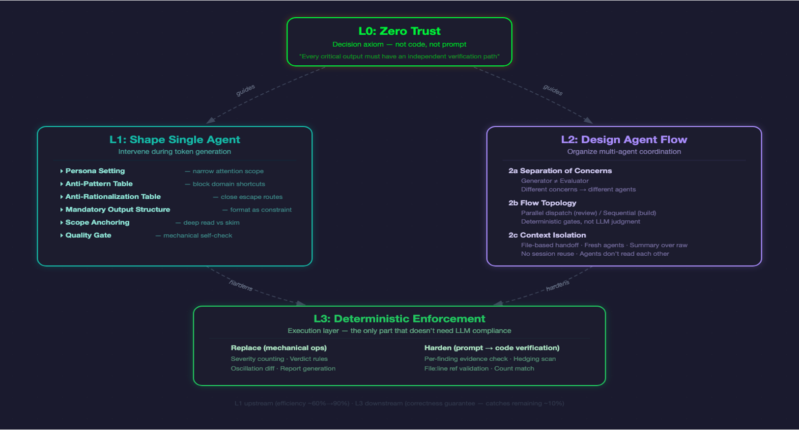

# OPC — One Person Company

> A full team in a single Claude Code skill. You're the CEO — OPC is everyone else.

16 specialist agents (PM, Designer, Security, Devil's Advocate, and more) that build, review, and evaluate your code through a digraph-based pipeline with code-enforced quality gates.

## How It Works

One principle: **the agent that does the work never evaluates it.**

```
Task → Flow Selection → Node Execution → Gate Verdict → Route Next
                              ↑                              ↓
                              └──────── ITERATE/FAIL ────────┘
```

1. **Task inference** — reads your request, picks a flow template (review, build-verify, full-stack, pre-release), and enters at the right node.

2. **Typed nodes** — each node has a type (discussion, build, review, execute, gate) with specific protocols. Build nodes produce commits. Review nodes dispatch parallel subagents. Gate nodes compute verdicts from code, not LLM judgment.

3. **Mechanical gates** — verdicts are computed by `opc-harness synthesize`: any red = FAIL, any yellow = ITERATE, all green = PASS. No LLM gets to decide if a finding is "important enough."

4. **Cycle limits** — max 3 loops per edge, 5 re-entries per node, 20-30 total steps depending on flow. Oscillation detection catches A↔B loops.

### Quality Architecture



The system is built on a zero-trust axiom: **every critical output must have an independent verification path.** Four layers:

- **L0 — Zero Trust**: Decision axiom — not code, not prompt. Every critical output needs an independent verification path.
- **L1 — Shape Single Agent**: Intervene during token generation — persona setting, anti-pattern tables, mandatory output structure, scope anchoring, quality gates.
- **L2 — Design Agent Flow**: Multi-agent coordination — separation of concerns, flow topology (parallel review / sequential build), context isolation (file-based handoff, fresh agents, no session reuse).
- **L3 — Deterministic Enforcement**: The only layer that doesn't need LLM compliance — mechanical ops (severity counting, verdict rules, oscillation diff) and hardened verification (file-finding evidence checks, hedging scans, ref validation).

## Quick Start

### Install

```bash
npm install -g @touchskyer/opc
```

Skill files are automatically copied to `~/.claude/skills/opc/`.

#### Manual install (no npm)

```bash
git clone https://github.com/iamtouchskyer/opc.git
cp -r opc ~/.claude/skills/opc
```

### Use it

```bash
# Review — dispatches 2-5 role agents in parallel
/opc review the auth changes

# Build — implements + independent review + gate
/opc implement user authentication with email/password

# Autonomous loop — decomposes, schedules cron, runs unattended
/opc loop build features F1-F4 from PLAN.md

# Interactive mode — asks clarifying questions first
/opc -i redesign the onboarding flow

# Explicit roles
/opc security devil-advocate

# Flow control
/opc skip          # skip current node
/opc pass          # force-pass gate
/opc stop          # terminate, preserve state
/opc goto build    # jump to node
```

## Autonomous Loop

```bash
/opc loop build the math tutoring app features F1-F4
```

What happens:
1. **Runbook lookup** — `opc-harness runbook match "<task>"` checks `--dir` flag → `OPC_RUNBOOKS_DIR` → `~/.opc/runbooks/` for a matching recipe. If one hits, its `units` / `flow` / `tier` become the plan; otherwise fall through to step 2. Disable per-invocation with `OPC_DISABLE_RUNBOOKS=1`. See [docs/runbooks.md](docs/runbooks.md) and [examples/runbooks/add-feature.md](examples/runbooks/add-feature.md).
2. **Decompose** (runbook miss only) — breaks task into atomic units (spec, implement, review, fix, e2e)
3. **Definition of done** — establishes verify/eval criteria per unit before any work starts
4. **Schedule** — durable cron (survives process restart) fires every 10 min
5. **Execute** — each tick runs one unit through the appropriate OPC flow
6. **Guard** — `opc-harness` enforces: git commit required, ≥2 independent reviewers, no plan tampering, no state forgery, artifact freshness, tick limits
7. **Terminate** — auto-stops when plan complete, tick limit hit, or wall-clock deadline reached

For well-scoped tasks, the system runs **10+ hours continuously** without intervention.

### Guardrails (code-enforced, not prompt-level)

| Guard | Enforcement |
|-------|-------------|
| Write nonce | Random SHA256 at init; state written by harness only |
| Atomic writes | write → rename (POSIX atomic); no truncated JSON on crash |
| Plan integrity | SHA256 hash at init; verified every tick |
| Review independence | ≥2 eval files, identical content rejected, line overlap warned |
| Git commit required | HEAD must change for implement/fix units |
| Screenshot required | UI units must produce .png/.jpg artifact |
| Tick limits | maxTotalTicks (units×3) + 24h wall-clock deadline |
| Oscillation detection | A↔B pattern over 4-6 ticks = warning/hard stop |
| Concurrent tick mutex | in_progress status blocks overlapping cron fires |
| JSON crash recovery | try/catch on all JSON.parse; structured errors, not crashes |
| External validators | Pre-commit hooks, test suites detected at init and leveraged |

## Flow Templates

| Template | Nodes | When |
|----------|-------|------|
| **review** | code-review → gate | PR review, audit, "find problems" |
| **build-verify** | build → code-review → test-design → test-execute → gate | "implement X", "fix bug Y" |
| **full-stack** | discuss → build → review → test → acceptance → audit → e2e → gates | Complex/vague requests |
| **pre-release** | acceptance → audit → e2e → gates | "verify before release" |

## Extensions

OPC has a capability-routed extension surface. Extensions live in
`~/.claude/skills/opc-extension/<name>/` — each with `ext.json` (capability
declarations) + `hook.mjs` exporting any of `promptAppend` / `verdictAppend`
/ `executeRun` / `artifactEmit` hooks. No fork, no rebuild. Hooks are
sandboxed via per-extension timeouts + circuit breakers, so a broken
third-party extension can't take down the harness.

The companion repo **[opc-extensions](https://github.com/iamtouchskyer/opc-extensions)** ships 4 extensions: `design-intelligence` (theme injection + design coverage + VLM visual eval), `git-changeset-review`, `memex-recall`, and `session-logex`.

Full authoring guide: **[docs/extension-authoring.md](docs/extension-authoring.md)** — zero-OPC-context
quickstart + reference, plus a starter template at `examples/extensions/_starter/`.

## Built-in Roles

```
Product:     pm, designer
User Lens:   new-user, active-user, churned-user
Engineering: frontend, backend, devops, architect, engineer
Quality:     security, tester, compliance, a11y
Specialist:  planner, user-simulator, devil-advocate
```

**Devil's Advocate** (the 10th person) is auto-included when consensus is near-unanimous or decisions are irreversible. Comes with an automated verification script that checks its own findings.

### Custom Roles

Add a `.md` file to `roles/`:

```markdown
---
tags: [review, build]
---
# Role Name

## Identity
One sentence: who you are and what you care about.

## Expertise
- **Area** — what you know about it

## When to Include
- Condition that triggers this role
```

Available immediately, no configuration needed.

## Testing

```bash
bash test/run-all.sh
```

100+ test files covering init-loop, complete-tick, next-tick, review independence, JSON crash recovery, compound defense, scope registry, criteria lint, pipeline E2E lint, D2 calibration, release packaging, and orchestrator-level E2E flow tests.

## Requirements

- [Claude Code](https://claude.ai/code) (CLI, desktop app, or IDE extension)
- Node.js >= 18
- Core runtime has no npm dependencies, no MCP server, no build step
- Optional: `jq` for `opc install-hooks` context-compaction hooks

## Works better with memex (optional)

OPC works standalone — pair it with [memex](https://github.com/iamtouchskyer/memex) for cross-session memory. Memex remembers which roles were useful, which findings were false positives, and your project-specific context.

```bash
npm install -g @touchskyer/memex
```

## What's New

See [CHANGELOG.md](CHANGELOG.md) for version history.

## Community

Using OPC? Share your setup in [Discussions → Show and tell](https://github.com/iamtouchskyer/opc/discussions/categories/show-and-tell). Questions go in [Q&A](https://github.com/iamtouchskyer/opc/discussions/categories/q-a). Feature ideas in [Ideas](https://github.com/iamtouchskyer/opc/discussions/categories/ideas).

## License

MIT
